# Grok Task 网站UI设计图（Mermaid）

## 1. 页面整体布局流程图

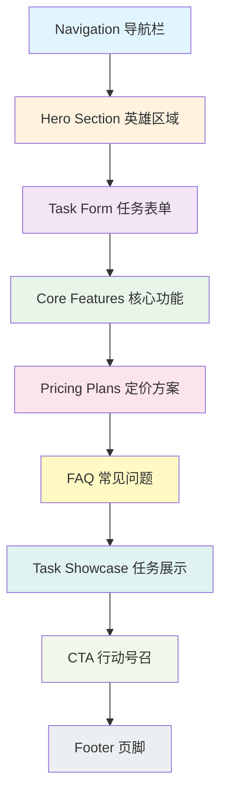

## 2. Hero Section 详细设计

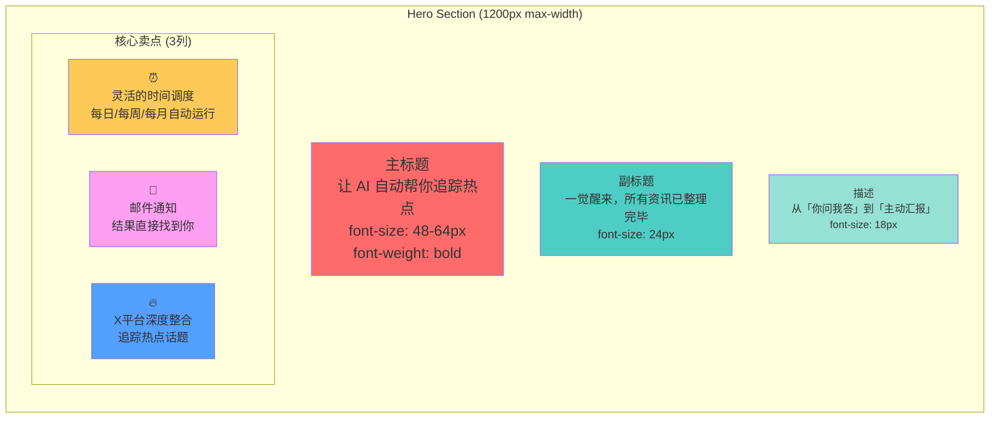

## 3. 任务表单设计

```mermaid
graph TB
    subgraph TaskForm["任务表单区域 (max-width: 800px)"]
        direction TB
        Title[快速创建任务<br/>直接在首页创建您的 AI 任务]

        Quota[配额显示<br/>剩余 X 免费次数 + Y 积分]

        Field1[任务名称 *<br/>input type=text<br/>placeholder: 例如：每日科技新闻汇总]

        Field2[执行频率<br/>select dropdown<br/>options: 单次/每天/每周/自定义]

        Field3[任务描述<br/>textarea<br/>可选字段]

        Field4[任务提示词 Prompt *<br/>textarea rows=6<br/>placeholder: 详细描述任务...]

        Hint[💡 提示<br/>写得越详细，AI 的输出质量越高]

        Buttons[按钮组<br/>AI 优化提示词 | 创建任务]

        Status[加载任务中...]
    end

    style Title fill:#a29bfe
    style Quota fill:#74b9ff
    style Field1 fill:#81ecec
    style Field2 fill:#81ecec
    style Field3 fill:#81ecec
    style Field4 fill:#81ecec
    style Hint fill:#ffeaa7
    style Buttons fill:#fab1a0
    style Status fill:#dfe6e9
```

## 4. 核心功能网格布局

```mermaid
graph TB
    subgraph CoreFeatures["核心功能展示 (3列 x 2行网格)"]
        direction LR
        row1[第1行]
        row2[第2行]

        subgraph Row1[""]
            CF1[⏰<br/>灵活的时间调度<br/>Cron表达式自定义<br/>每天8点/每周一/每月底]
            CF2[📧<br/>外部通知机制<br/>邮箱推送<br/>设置后就忘掉]
            CF3[🔥<br/>X平台深度整合<br/>话题标签/用户监控<br/>舆情分析]
        end

        subgraph Row2[""]
            CF4[🎯<br/>智能任务模板<br/>内容创作/市场营销<br/>一键创建]
            CF5[📊<br/>完整执行历史<br/>永久保存<br/>筛选/搜索/导出]
            CF6[⚡<br/>高级分析能力<br/>资源密集型任务<br/>最长3分钟]
        end
    end

    style CF1 fill:#48dbfb
    style CF2 fill:#0abde3
    style CF3 fill:#5f27cd
    style CF4 fill:#ff6b6b
    style CF5 fill:#ee5a6f
    style CF6 fill:#f368e0
```

## 5. 定价方案对比

```mermaid
graph LR
    subgraph Pricing["定价方案 (3列等宽)"]
        P1[免费版<br/>━━━━━━━━<br/>¥0<br/>永久免费<br/><br/>• 3次/天任务<br/>• 3次/天AI问答<br/>• 所有模板<br/>• 社区支持<br/><br/>[免费开始]]
        P2[Pro专业版 月付<br/>🔥 推荐<br/>━━━━━━━━<br/>¥29/月<br/>原价 ¥58<br/><br/>• ✨ 无限次任务<br/>• ✨ 无限次问答<br/>• 邮件通知<br/>• 优先队列<br/><br/>[立即订阅]]
        P3[Pro专业版 季付<br/>💎 季付优惠<br/>━━━━━━━━<br/>¥78/季<br/>原价 ¥174<br/><br/>• ✨ 无限次任务<br/>• ✨ 无限次问答<br/>• 邮件通知<br/>• 优先队列<br/><br/>[立即订阅]]
    end

    style P1 fill:#dfe6e9
    style P2 fill:#a29bfe,color:#fff
    style P3 fill:#74b9ff
```

## 6. FAQ 区域设计

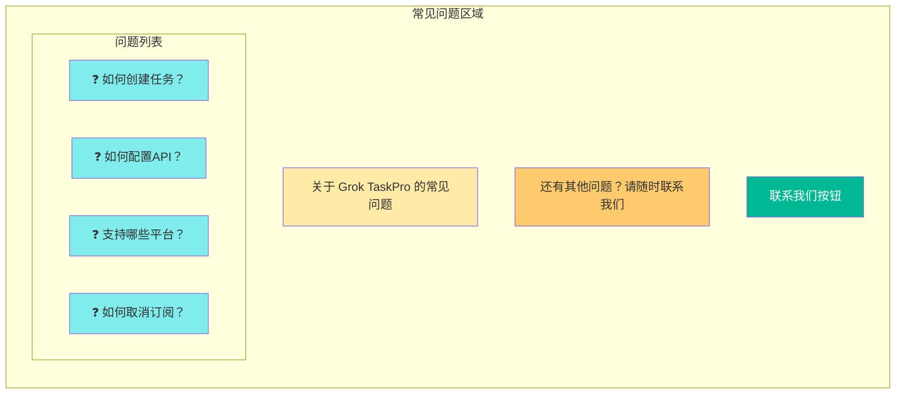

## 7. 任务展示区域

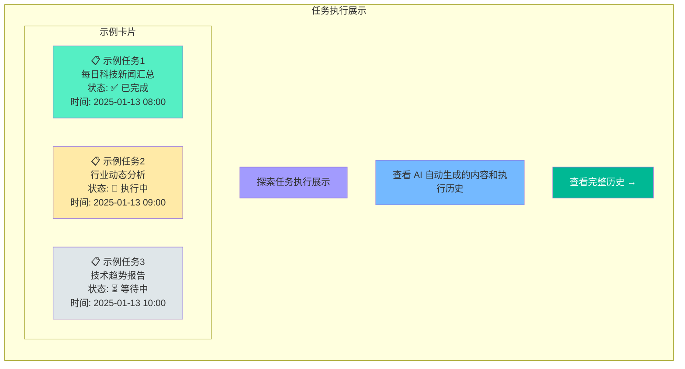

## 8. CTA 行动号召

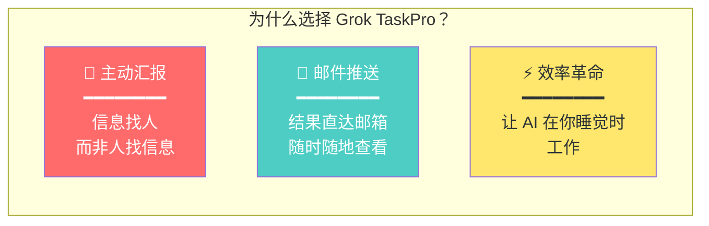

## 9. 响应式断点设计

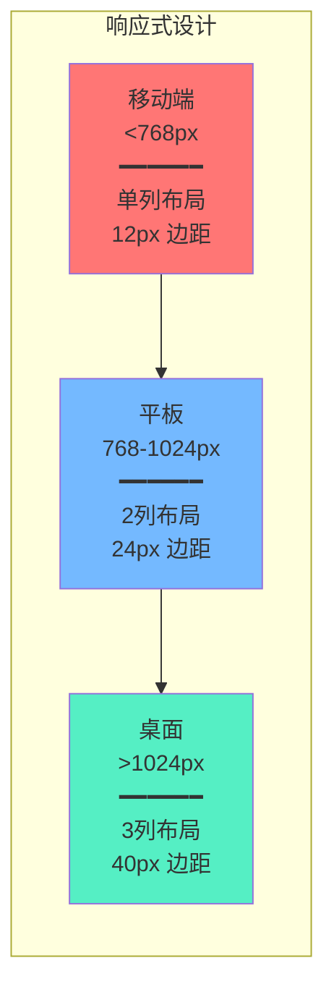

## 10. 组件层次结构

```mermaid
graph TB
    subgraph Page["HomePage Component"]
        Container[Container max-w-7xl mx-auto]

        subgraph Sections["页面区块"]
            Hero[HeroSection]
            Form[TaskFormSection]
            Features[CoreFeaturesSection]
            Pricing[PricingSection]
            FAQ[FAQSection]
            Showcase[TaskShowcaseSection]
            CTA[CTASection]
            Footer[Footer]
        end

        subgraph Components["可复用组件"]
            Button[Button Component]
            Input[Input Component]
            Select[Select Component]
            Card[Card Component]
            Badge[Badge Component]
        end
    end

    Container --> Sections
    Sections --> Components

    style Page fill:#2d3436,color:#fff
    style Container fill:#636e72,color:#fff
    style Hero fill:#e17055
    style Form fill:#00b894
    style Features fill:#0984e3
    style Pricing fill:#6c5ce7
    style FAQ fill:#fdcb6e
    style Showcase fill:#e84393
    style CTA fill:#00cec9
    style Footer fill:#636e72
    style Button fill:#d63031
    style Input fill:#fd79a8
    style Select fill:#fdcb6e
    style Card fill:#ffeaa7
    style Badge fill:#55a3ff
```

## 11. 颜色系统

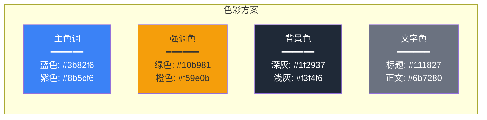

## 12. 用户交互流程

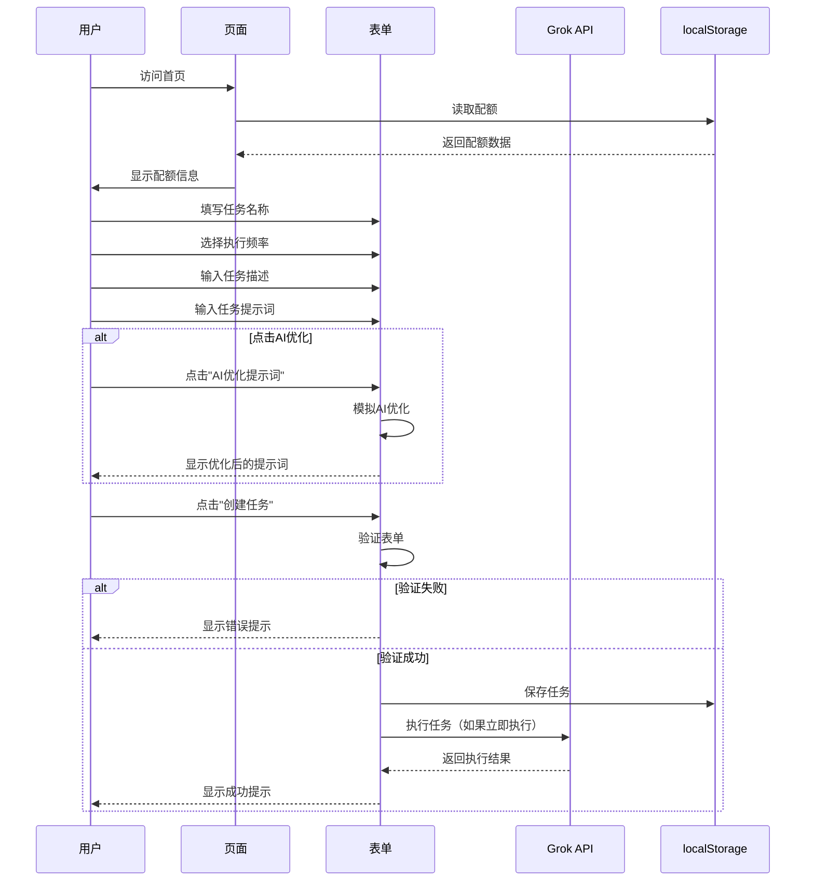

## 13. 状态管理流程

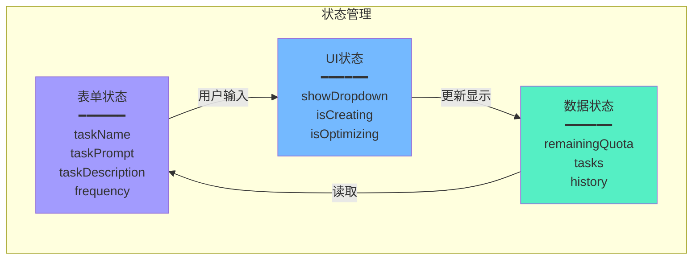

## 14. 数据流图

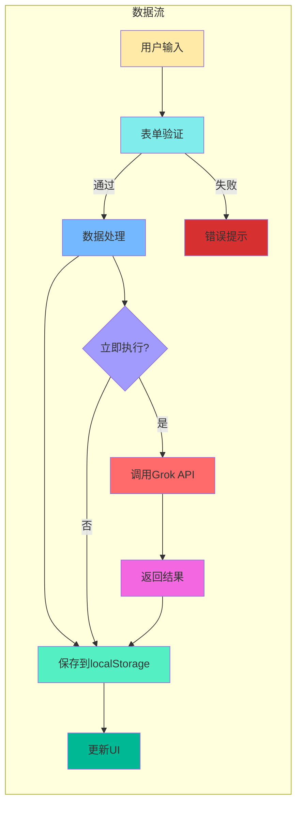

## 15. 实现优先级

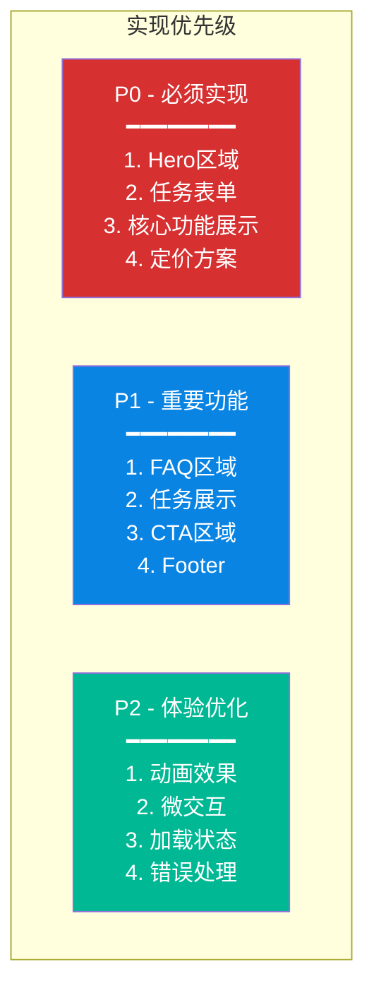

---

## 总结

以上15个设计图涵盖了：

1. ✅ 页面整体布局
2. ✅ Hero Section详细设计
3. ✅ 任务表单设计
4. ✅ 核心功能网格布局
5. ✅ 定价方案对比
6. ✅ FAQ区域设计
7. ✅ 任务展示区域
8. ✅ CTA行动号召
9. ✅ 响应式断点设计
10. ✅ 组件层次结构
11. ✅ 颜色系统
12. ✅ 用户交互流程
13. ✅ 状态管理流程
14. ✅ 数据流图
15. ✅ 实现优先级

**下一步**: 根据这些设计图重新实现代码
